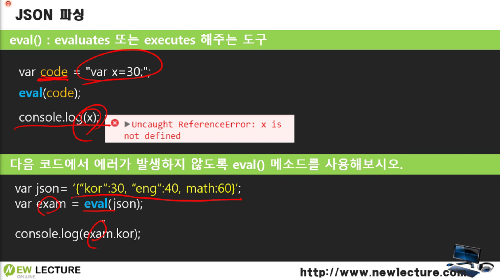
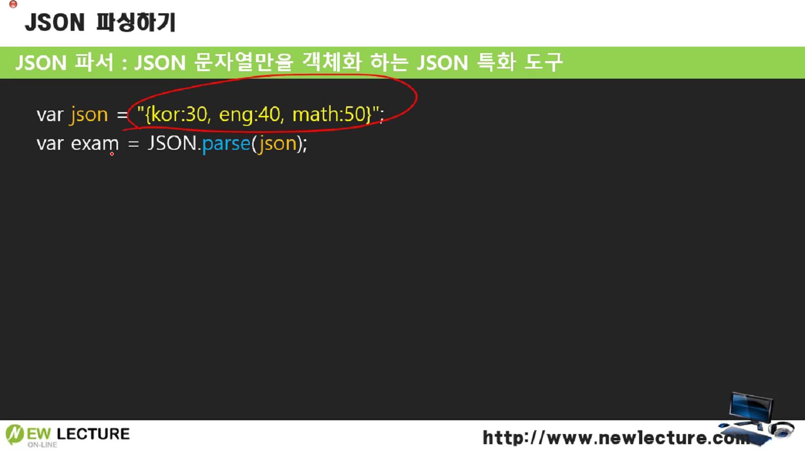

# JSON 파싱


## eval()

**`execute value`**: value를 실행해주는 함수



문자열로 되어있는 value 안의 값을 실행해준다.

```javascript
var value = "var x = 30;";
eval(value);    // value 안의 값을 실행해준다.
console.log(value);
```

문자열로 된 객체형식의 배열을 eval 할 때에는 문자열 안의 배열이 객체화되지 않은 상태에서 개체만 있는 경우이기 때문에 eval을 하지 못한다.

=> **객체를 변수로 명명해준 값을 eval()에 넣어주거나, eval()된 결과를 변수에 대입해줘야 오류가 나지 않는다.**

```javascript
var value = "{'id': 1, title: 'hello'}";    // 문자열로 된 배열
eval(value);    // value 안의 값을 실행할 수 없는 상태.
console.log(value);	// error
```

data라는 이름의 변수로 생성하고 그 값을 eval 안에 넣거나, eval 안에서 data 변수를 넣어서 생성해도 된다.

```javascript
var value = "{'id': 1, title: 'hello'}";    // 문자열로 된 배열
eval("var data="+value+";");
var data = eval("("+value+")");	// 함수안에 문자열로 넣어야 한다

console.log(value);	// {'id': 1, title: 'hello'}
console.log(data);	// {id: 1, title: 'hello'}
```

그러면 동일하게 문자열로 된 배열을 실행할 수 있게 된다.


## JSON parser



eval 할 필요 없이 parsing을 통해서 **한번에 문자열만을 객체화 할 수 있다**.

하지만 아래의 코드와 같이 실행하면 오류가 난다. 왜일까?

```javascript
var value = "{'id': 1, title: 'hello'}";    // 문자열로 된 배열
var data = JSON.parse(value);
console.log(value);	// error
```

json은 키값을 무조건 **더블 따옴표**를 사용해야 한다. 그리고 바깥 따옴표는 홑따옴표로 변경해준다.

```javascript
var value = '{"id": 1, "title": "hello"}';
var data = JSON.parse(value);
console.log(data.title);	// hello
console.log(value);	// {"id": 1, "title": "hello"}
```

이렇게 바꿔주면 오류나지 않고 잘 파싱된 결과를 출력해낼 수 있다.

이렇게 parse를 통해서 원하는 데이터를 받아서 파싱할 수 있게 된다.


## Stringfy

```javascript
var json = JSON.stringify([1,2,3,{id:1, writer:'newlec'}]);
console.log(typeof json);	// string
console.log(json);	// [1,2,3,{id:1, writer:'newlec'}]
```

stringfy를 하면 배열을 문자열로 바꿀 수 있다.

※ typeof을 통해 변수의 타입을 알아낼 수 있다.

typeof를 통해 변수 json이 문자열로 잘 변환된 결과를 볼 수 있다.


------

※ 출처: 뉴렉처(newlecture)