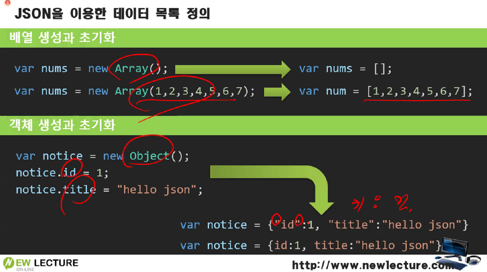
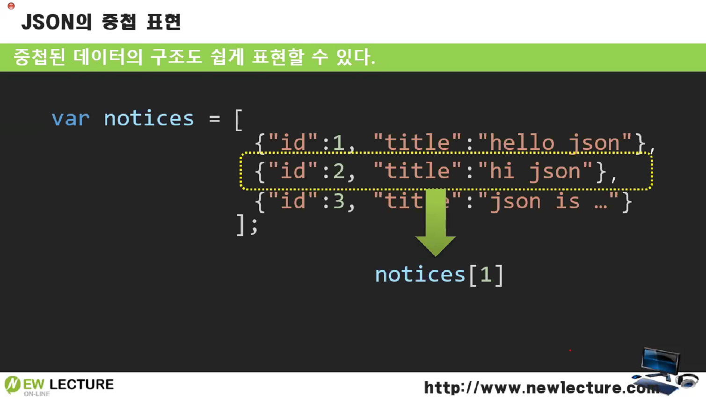
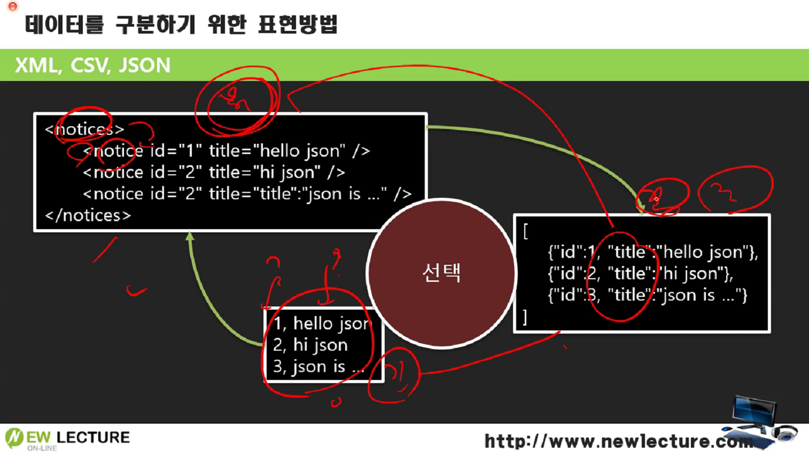

# JSON

------


JSON: JavaScript Object Notation

json은 데이터를 자바스크립트의  객체문법으로 표현하는 표기법이다.


※ 모든 자료형(변수)이 참조형이라 개체이며, 메모리에 올라갈 때 전부 **`heap`**에 올라간다.

=> **가비지 컬렉터(Garbage Collector)**가 존재한다.


## Javascript 데이터 객체와  JSON 생성 방법


json이 일반 객체 생성방법보다 훨씬 간단하고, 편리하다.



배열과 객체를 초기화할 때 new를 할 필요가 없으며, 한번에 바로 값을 대입할 수 있다.

따옴표를 사용할 때 싱글로 사용하거나 생략할 수도 있지만, 큰 따옴표로 사용하게 될 경우 HTML에서 사용할 때 충돌이 일어나는 문제가 생길 수도 있다. 그래서 보통은 큰 따옴표를 사용한다.


## JSON의 중첩 표현



객체형식의 배열을 중첩해서 담을 수도 있다.


## 데이터를 구분하기 위한 표현방법



※ `csv 파일`: 콤마로 구분된 파일

※ XML: 태그기법으로 데이터 표현

csv(하단)는 너무 단순하고 강력하지 못한 단점을 XML(좌측 상단)을 통해 구조를 가지고 강력하게 했지만, 간결하지 못하고 복잡해 보이는 것의 단점을 보완해서 JSON의 중첩배열로 **간결하면서도 강력한 구조의 데이터**를 담을 수 있게 되었다.

```javascript
var notices = [
    {id:1, title: "hello json"},
    {id:2, title: "hi json"},
    {id:3, title: "json is..."}
];
console.log(notices[1].title);	// hi json
console.log(notices[1]["title"]);	// hi json
```


------

※ 출처: 뉴렉처(newlecture)