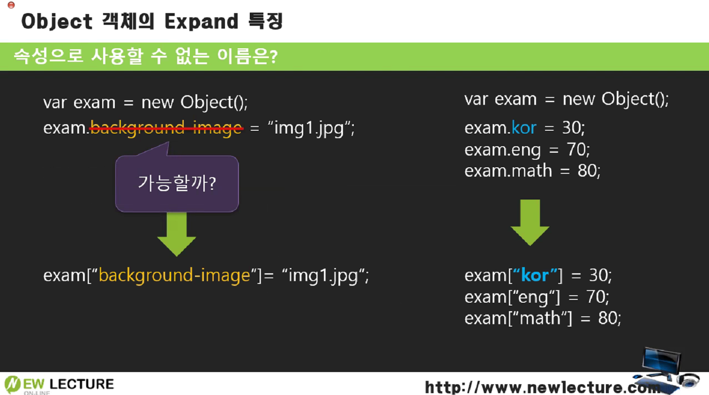

## Object 객체


프로그래밍 언어에는 종류에 상관없이 3가지 컬렉션(List, Map, Set)을 지원한다.  하지만 JS의 경우 ES 6 이전에 List밖에 없었고, 다음 버전인 ES 6에서는 나머지 컬렉션들이 추가가 되었다.

List 계열의 컬렉션은 Array이다. Map은 object를 이용하는 개념인데, ES6에서 등장한다. ES5에서는 Map을 사용하지 않았다. Set이라는 컬렉션도 ES6이후에 추가되었다.


객체지향과 관련된 캡슐화, 은닉성, 상속 등을 자바스크립트의 Object에서는 지원하지 않는다. 그런데 모든것들이 **객체**로 되어있다. 객체지향적인 것을 지원하지는 않지만 객체로 되어있어서 다른 방법으로 사용하다가 ES6에서 등장하게 되었는데, **호환성**을 위해서 과거의 꼼수로 사용하던 방식이 사라지지 않고 함께 사용되고 있다.

> 속성정의 + 속성다루기 => 컬렉션(Map)처럼 사용.


### Expand Object


속성이 Object에 **확장**되어서 붙는 것.

```javascript
var exam = {};  //new Object();
exam.kor = 30;  // 속성이 없다가 생기는 것.
exam.eng = 70;	// 속성 eng가 추가.
console.log(exam);
```


값을 바꿔도, exam.kor + exam.eng의 결과는 100이 나온다. 그 이유는 Kor로 대문자를 붙여서 달라졌기 때문이다.

=> 자바스크립트는 버그가 있어도 브라우저에서 오류가 안나는 경우가 많기 때문에 꼼꼼하게 체크해야 한다.


#### 객체의 속성명



예를 들어서 background-image 같은 대쉬(-)가 포함된 속성명이 가능할까?

그런 속성명을 하기 위해서는 일반적인 속성명처럼 사용하는 것은 안되며, 문자열에 대괄호로 감싸서 ["background-image"]와 같이 사용가능하다.

속성을 이런식으로 대괄호에 문자열 표현으로 나타낼 수도 있다.

```javascript
var exam = {};  //new Object();
exam.kor = 30;  // 속성이 없다가 생기는 것.
exam.eng = 70;
console.log(exam);
console.log(exam.kor + exam["eng"]);	// 100 	// .속성 == ["속성"]
```


#### 객체의 속성 제거


객체의 속성을 지울 때 **delete**를 사용한다.

```
delete exam.kor;
```

=> Object를 Map 처럼 저장소로 쓰고 있었던 것이기 때문에 객체에 저장되었던 속성을 지울 수 있다.

```javascript
var exam = {};  //new Object();
exam.kor = 30;  // 속성이 없다가 생기는 것.
exam.eng = 70;
console.log(exam);	// {kor: 30, eng: 70}
delete exam.eng;
console.log(exam.kor + exam["eng"]);	// NaN
console.log(exam);	// {kor: 30}
```


------

※ 출처: 뉴렉처(newlecture)
