# 연산자


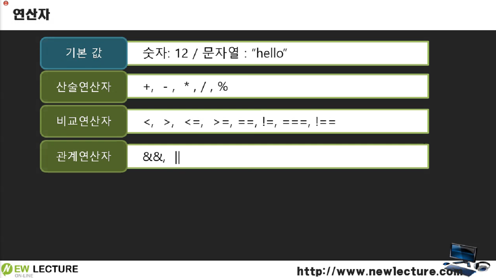


## 비교 연산자

```javascript
var x = "3";
var y = "3";

//  객체를 비교 => ===

console.log(x == y);	// true
//자바스크립트에서는 == 이 값을 비교(자바에서는 == 이 객체가 같은지 비교)

console.log(x === y);	// true
// 참조비교(런타임 환경이 객체화 할 때 어차피 같은 객체 참조를 대입, 즉 같은 객체를 가리키게 되기 때문에 true로 나온다.)
```

> `==`: 값을 비교
>
> `===`: 참조 비교

런타임 환경이 객체화를 할 때, 다른 쪽에 똑같은 키워드를 갖고 있는 문자열을 또 객체화해달라고 할 때 어차피 같은 값이니까 같은 것을 쓰라며 런타임 환경이 **같은 객체를 참조**하게 된다.


```javascript
var x = "3";
var y = new String("3");// 다른 객체를 가르키게 하고 싶다면 새로 문자열을 생성해야 한다.

//  객체를 비교 => ===

console.log(x == y);	// true(값이 같음)
console.log(x === y);	// false(객체가 다름)
```

> 만약에 3이라는 다른 객체를 대입하기를 원했다면, 위처럼 **새로운 문자열을 생성**하는 생성자를 통해 값을 넣어주게 되면, 객체는 다르고 값은 같게 나오게 된다.


## 복합 연산


### 숫자와 문자열의 산술연산

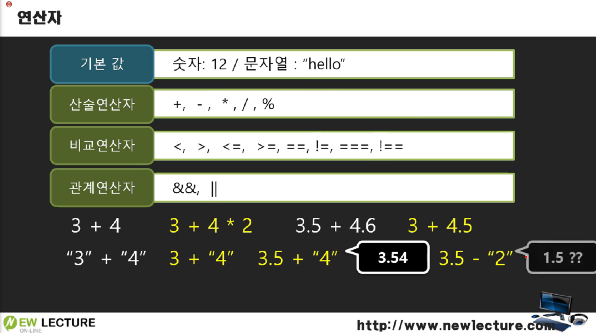

**`숫자 + 문자열`** = 숫자와 문자열이 그대로 붙는다. 

```javascript
3 + "4" = 34
3.5 + "4" = 3.54
```


**`숫자 - 문자열`** = 문자열이 숫자로 바뀌어서 연산이 된다.

```javascript
3.5 - "2" = 3.5 - 2 = 1.5
```


### 숫자와 문자열의 비교연산

문자열 비교는 첫번째 글자를 먼저 비교한다. 동일하면 그 다음에 뒤의 글자로 크기를 비교한다.

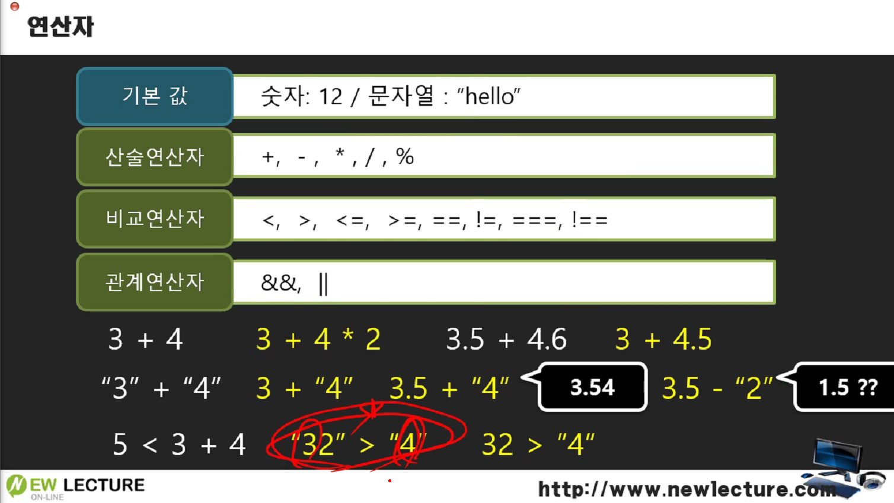

ex1) `"32" > "4"`와 같은 문자열을 비교해보자면, 첫번째 글자인 3과 4를 비교해서 4가 크기 때문에 "4"가 더 크게 되는 것이다. 만약에 첫번째 글자의 수가 동일하다면, 이후 두번째 글자를 두고 크기를 비교하게 된다.

ex2) `32 > "4"` 같이 숫자와 문자열을 비교할 때에는 문자열이 숫자로 바뀌게 된다.


### 기타 연산

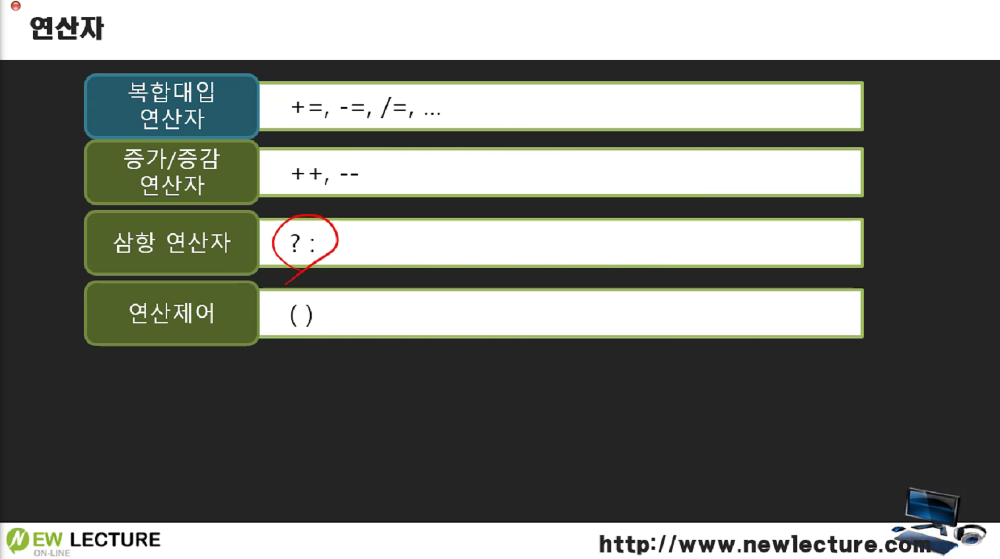


## 논리값

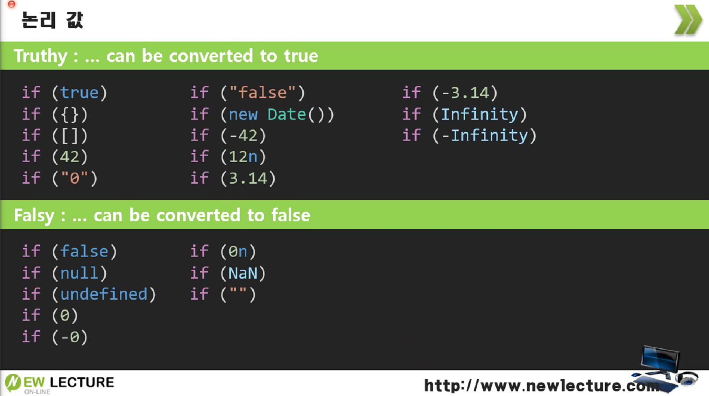

`truethy / falsy` : 자신이 true / false 값이 되는 경우가 있다. 해당 값을 truethy한 값, falsy한 값이라고 말한다.

※ 0n은 그냥 0으로 변환된다. 0으로 시작하는 기호가 붙은 것들은 다 0이다. => falsy

자바스크립트는 비교할 때 문자열이 오면 빈 문자열이 아니라면 true가 되고 그 문자열이 반환된다.


### 논리값을 OR 연산자로 비교하기

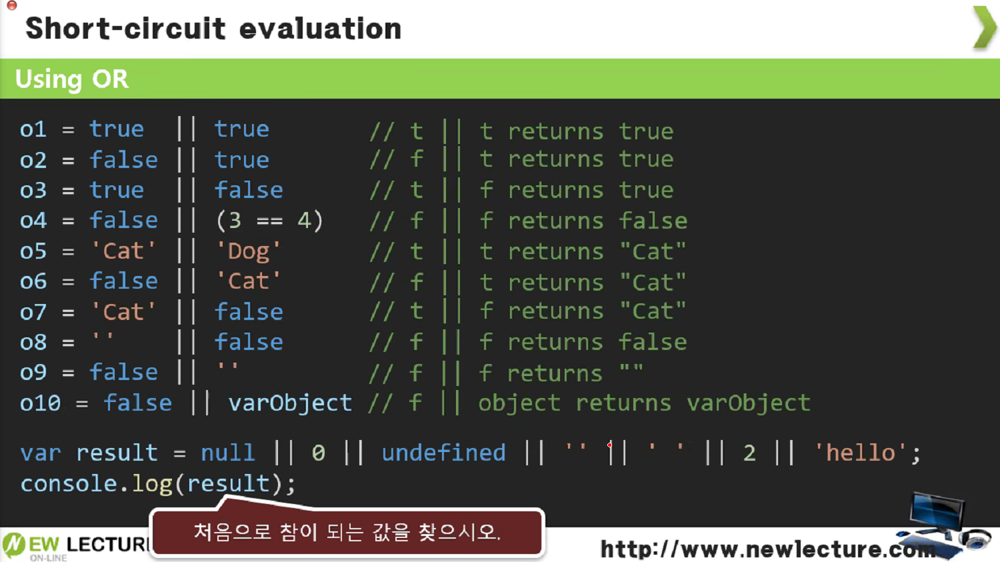

OR 연산자는 참이 되는 논리값이 반환된다. 만약 두값 다 거짓이라면 거짓이 반환된다. 또한 두값 다 참이라면 처음으로 참이 나온 값을 반환한다.

5번같은 예시에서는 "Cat"이 반환되었는데,  두값 다 참이기 때문에 처음으로 참이 되는 값인 "Cat"을 반환하게 된다.

varObject는 그냥 변수이기 때문에 true가 되고 truethy한 값인 varObject가 반환된다.

**만약 두값 모두 false면 마지막 false가 반환**된다.

```javascript
var result = null || 0 || undefined || '' || ' ' || 2 || 'hello';
console.log(result);    // ' '
```

앞의 것들이 거짓들이다가 4번째의 공백 문자열은 false고, 빈 문자열이 들어간 문자열이 true가 되서 반환이 된다.   => **참일 때까지 앞에서부터 하나씩 비교**하게 된다.


### 논리값을 AND 연산자로 비교하기

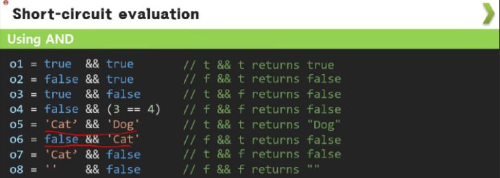

and 연산자는 두값 다 참이 아니면 거짓이 나오고 처음으로 거짓이 나오는 값이 나온다. **그래도 거짓이 없으면(둘다 참이면) 마지막 값이 대입**된다.


```javascript
var result = 'a' && 3 && 'undefined' && 0 && ' ' && 2;
console.log(result);	// 0
```

> 가장 먼저 거짓으로 나오는 값이 0이기 때문에 0이 반환된다.


### OR AND 연산자 함께 사용하기(연산자 우선순위)

논리값 3개를 연산자 OR와 AND를 함께 쓰면 **&& 연산자가 우선순위가 높아서 먼저 연산**된다. 만약 괄호()처리가 되었다면 결과값은 달라질 수 있다.

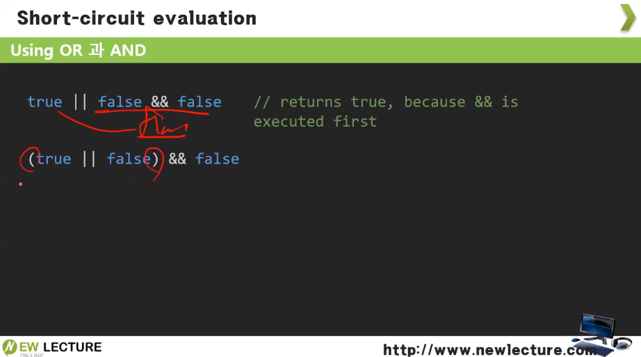

```javascript
true || false && false // true || (false && false) = true || false => true 
```

```javascript
(true || false) && false // true && false = false
```


## 연산자를 이용한 기본값 설정하기

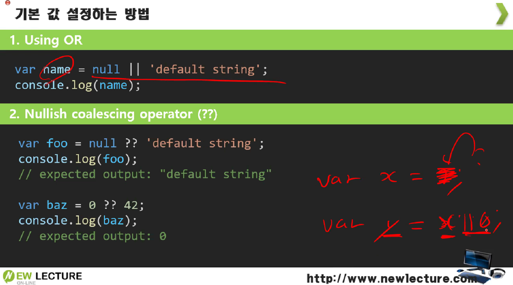

OR연산자를 사용하는 예시) 예를 들어 x값을 y에 대입해서 기본값을 설정하고 싶은데, x에 값이 없을 경우에 0을 반환하게 하고 싶다고 하자. 그럴 경우에 or 연산자를 통해 x || 0 => x가 false(undefined)일 때, 즉 **x가 falsy한 값**을 가지면 0을 대입하는 식으로 사용할 수 있게 된다.

```javascript
var x;

var y = x || 1; // 값이 없으면 1이 나온다.
var y = x ?? 1; // 값이 없으면 1이 나온다.
console.log(y);	// 1
```

`nullish`: 앞의 값이 null이나 false이면 뒤의 값이 반환된다.


## NaN

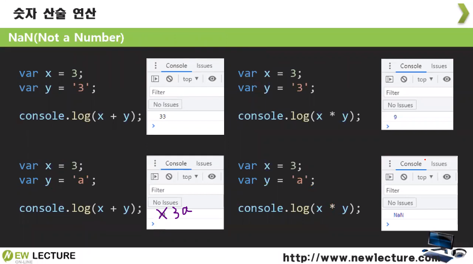

NaN은 별개의 값이 된다. 전역 객체의 프로퍼티 중 하나이다.

```javascript
var x = 3;

var y = "a";
console.log(x*y);   // NaN -> Not a Number(에러가 아닌 undefined처럼 엄연히 값이다.) => (숫자와 문자열은 곱하기가 안된다.)
```

이렇게 결과값이 NaN이 나오기 때문에 연산이 되지 않는다. 숫자와 문자열은 곱하기는 되지 않는다.(단, 숫자로 된 문자열은 숫자로 변형되서 계산된다.)

※ 숫자로 된 문자열/ 문자열 둘다 덧셈(+)을 할 때는 앞의 값의 뒤에 붙는다.


## 전역함수(Global function)을 통한 값 검사

전역객체 프로퍼티의 메소드로, 전역객체의 값에 대한 검사를 위한 함수들이 있다.

만약에 위의 내용처럼 어떤 연산된 값이 NaN인 것을 검사를 통해 알아내고 싶어서 다음과 같이 작성했다.

```javascript
var x = 3;
var y = "a";
var result = x*y;

if(result == NaN)   // NaN은 비교연산자로는 못잡아낸다.
    console.log("앗");
else
    console.log("ㅜㅜ");	// 출력
```

이렇게 비교연산자로는 NaN인 것을 잡아내지 못하기 때문에 **NaN인지 물어보는 함수를 사용**해야 한다.

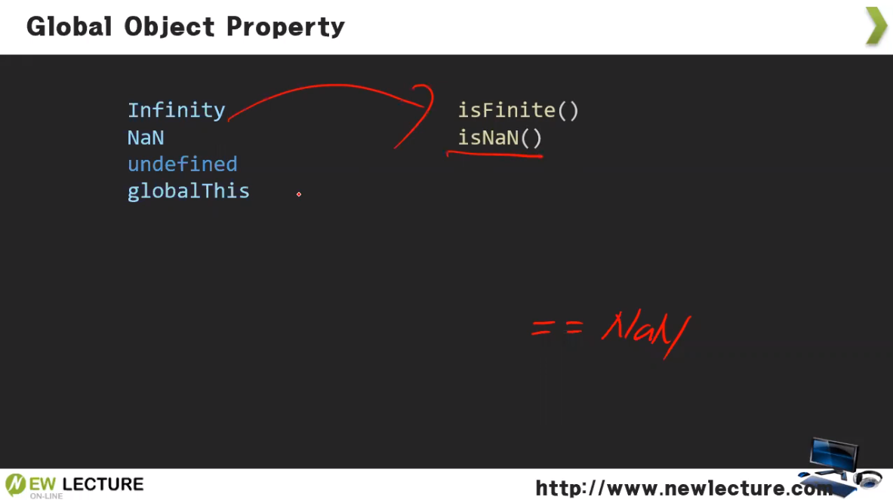

```javascript
if(isNaN(result))
    // NaN은 isNaN이라는 함수로 비교해야 한다.
    console.log("앗");
else
    console.log("ㅜㅜ");
```

이렇게 하면 NaN인 것을 잡아내고 if문의 콘솔이 출력되는 결과를 볼 수가 있게 된다.


------

※ 출처: 뉴렉처(newlecture)