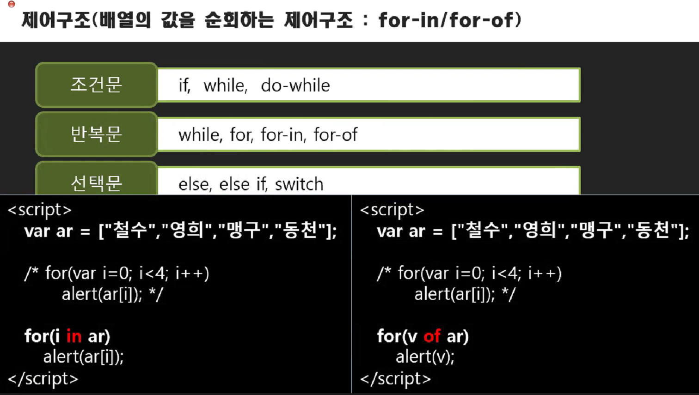

# 제어구조



for of는 ES6이후부터 등장한다.

for문은 배열의 개수를 지정해야한다. 반복적인 작업에서 코드량이 있다는 것이다. for in문은 그것을 해결해준다.

```javascript
var letters = ['a','b','c','d','e'];

for(var i in letters)	// key를 꺼내고 싶을때 for in 사용
    console.log(letters[i]);	// a b c d e

for(var v of letters)   // 값을 꺼내고 싶을 때 for of 사용
    console.log(v);	// a b c d e	// 굳이 인덱스를 이용해서 값을 꺼낼 필요가 없다
```

변수명만 지정해주면 개수, ++, 등을 해줄 필요가 없다. 이는 배열의 크기만큼 전체를 반복하고 싶을때 유용하다.

for in은 배열의 key를 꺼내고 싶을 때 사용한다.

또한 for of는 배열의 값을 꺼내고 싶을 때 사용가능하다.


## 객체를 이용한 for in 

```javascript
var exam = {kor: 30, eng: 40, math: 50};

for(var k in exam) {
    console.log(k); 	// kor eng math(키 출력)
}

for(var v of exam)
    console.log(v);  // error
```

※ 여기서 값을 꺼내고 싶어서 for of를 썼는데 에러가 났다. 과거에는 for of문을 사용할 수가 없었다. 실제로 map 컬렉션은 이터레이터를 가지고 있어서 사용할 수 있는데, 이것을 map 계열의 컬렉션을 활용할 때에는 for of의 특별한 능력도 같이 받을 수 있다.

=> object는 map처럼 썼지만 map은 아니기 때문에 for of를 사용할 수 없다.

여기서는 for of로 값을 꺼낼 수 없기 때문에 for in문을 통해 키를 이용해서 꺼내야 한다. 

```javascript
var exam = {kor: 30, eng: 40, math: 50};

for(var k in exam) {
    console.log(k); // 키 출력
    console.log(exam.k);   // undefined
    console.log(exam[k]);   // 값 출력
}
```

저렇게 키를 통해서 값을 꺼내기 위해 **exam.k로 했더니 undefined**가 난다. 그 이유는 kor가 갑자기 속성이 붙어서 초기화되지 않은 상태의 값이 출력되다보니까 undefined가 나온 것이다.


------

※ 출처: 뉴렉처(newlecture)